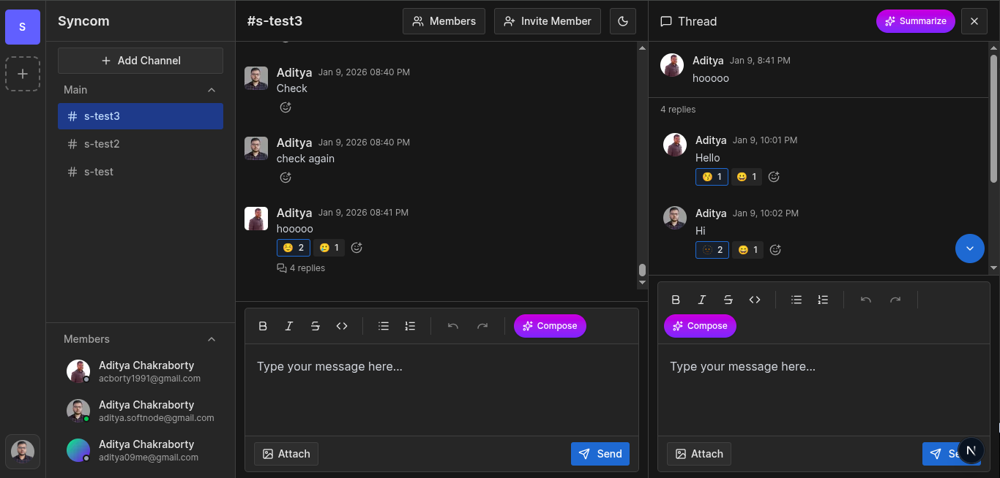
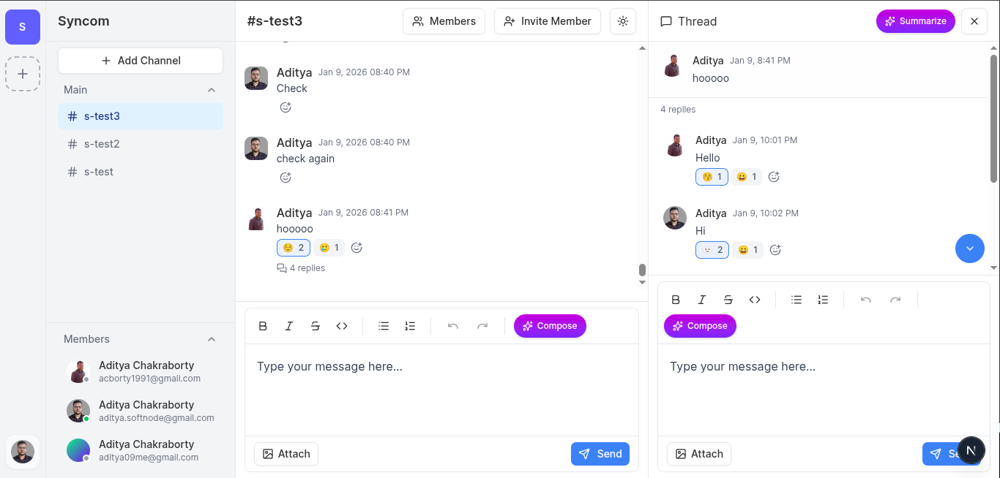

# Syncom

A modern, real-time team collaboration platform built with Next.js, featuring workspace management, channels, messaging, and AI-powered assistance.





## 📋 About The Project

Syncom is a comprehensive team communication and collaboration platform that enables teams to organize their work into workspaces and channels. With real-time messaging, threaded conversations, reactions, and AI assistance, Syncom provides a seamless communication experience for modern teams.

## 🚀 Technologies Used

### Core Framework

- **Next.js 15.5.7** - React framework with App Router
- **React 19.2.0** - UI library
- **TypeScript 5** - Type-safe development

### Backend & Database

- **Prisma 7.1.0** - ORM for database management
- **PostgreSQL** - Primary database (via Neon adapter)
- **oRPC** - Type-safe RPC framework for API routes

### Authentication & Security

- **Kinde Auth** - Authentication and user management
- **Arcjet** - Bot detection and security middleware

### Real-time Features

- **PartyKit** - Real-time WebSocket server (Cloudflare Durable Objects)
- **PartySocket** - WebSocket client library

### UI & Styling

- **Tailwind CSS 4** - Utility-first CSS framework
- **Radix UI** - Accessible component primitives
- **Framer Motion** - Animation library
- **Lucide React** - Icon library
- **Shadcn/ui** - Component library

### Rich Text Editing

- **Tiptap** - Headless rich text editor
- **Lowlight** - Syntax highlighting for code blocks

### AI Integration

- **Vercel AI SDK** - AI integration framework
- **OpenRouter** - AI model provider

### File Management

- **UploadThing** - File upload service

### State Management & Data Fetching

- **TanStack Query** - Server state management
- **React Hook Form** - Form state management
- **Zod** - Schema validation

### Development Tools

- **ESLint** - Code linting
- **Wrangler** - Cloudflare Workers CLI

## ✨ Features

### 🏢 Workspace Management

- Create and manage multiple workspaces
- Organization-based workspace isolation
- Workspace member management
- Role-based access control

### 💬 Channel-based Communication

- Create unlimited channels within workspaces
- Public and private channel support
- Channel-specific messaging
- Real-time channel updates

### 📨 Messaging System

- Rich text message composition with Tiptap editor
- Image attachments via UploadThing
- Message editing and deletion
- Code block support with syntax highlighting
- Text formatting (bold, italic, lists, etc.)

### 🧵 Threaded Conversations

- Reply to messages in dedicated threads
- Thread sidebar for focused discussions
- Real-time thread updates
- Thread reply notifications

### 😊 Message Reactions

- Add emoji reactions to messages
- Multiple reactions per message
- Real-time reaction updates
- User-specific reaction tracking

### 👥 Real-time Presence

- See who's currently online in your workspace
- Live user status updates
- Active user indicators
- WebSocket-based presence system

### 🤖 AI Assistant

- AI-powered message suggestions
- Context-aware responses
- Integration with OpenRouter AI models
- Vercel AI SDK integration

### 🔒 Security Features

- Secure authentication with Kinde
- Bot detection and prevention with Arcjet
- Protected API routes
- Middleware-based security checks

### 🎨 User Experience

- Dark mode support with next-themes
- Responsive design for all devices
- Smooth animations and transitions
- Accessible UI components
- Resizable panels for customizable layouts

### 📊 Data Management

- Type-safe database queries with Prisma
- Optimistic UI updates
- Efficient data caching with TanStack Query
- Real-time data synchronization

## 🛠️ Getting Started

### Prerequisites

- Node.js 20 or higher
- pnpm (recommended) or npm/yarn
- PostgreSQL database
- Cloudflare account (for real-time features)

### Installation

1. Clone the repository

```bash
git clone https://github.com/adityackr/syncom.git
cd syncom
```

2. Install dependencies

```bash
pnpm install
```

3. Set up environment variables

```bash
cp .env.example .env
```

Fill in the required environment variables in `.env`

4. Set up the database

```bash
pnpm dlx prisma generate
pnpm dlx prisma db push
```

5. Run the development server

```bash
pnpm dev
```

6. (Optional) Run the real-time server locally

```bash
pnpm dlx wrangler dev
```

Open [http://localhost:3000](http://localhost:3000) to see the application.

## 📦 Project Structure

```
syncom/
├── app/                    # Next.js app directory
│   ├── (dashboard)/       # Dashboard routes
│   ├── (marketing)/       # Marketing pages
│   ├── api/               # API routes
│   ├── middlewares/       # Custom middlewares
│   ├── router/            # oRPC routers
│   └── schemas/           # Zod schemas
├── components/            # Reusable UI components
├── hooks/                 # Custom React hooks
├── lib/                   # Utility functions and configs
├── prisma/                # Database schema
├── providers/             # React context providers
├── realtime/              # PartyKit real-time server
└── public/                # Static assets
```

## 🚢 Deployment

### Next.js Application

Deploy the Next.js application to Vercel:

```bash
pnpm build
```

### Real-time Server

Deploy the PartyKit server to Cloudflare Workers:

```bash
pnpm dlx wrangler deploy
```

## 📝 License

This project is private and proprietary.

## 🤝 Contributing

This is a personal project. Contributions are not currently accepted.

## 📧 Contact

For questions or feedback, please reach out to the project maintainer.
